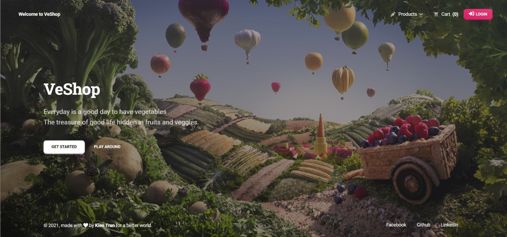
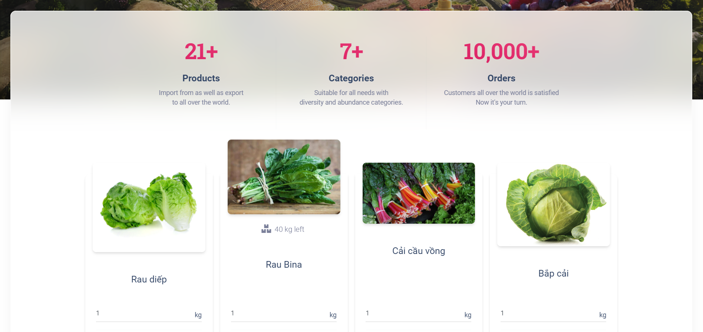
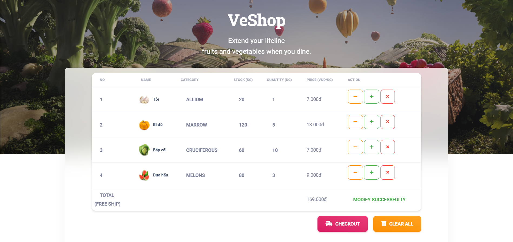
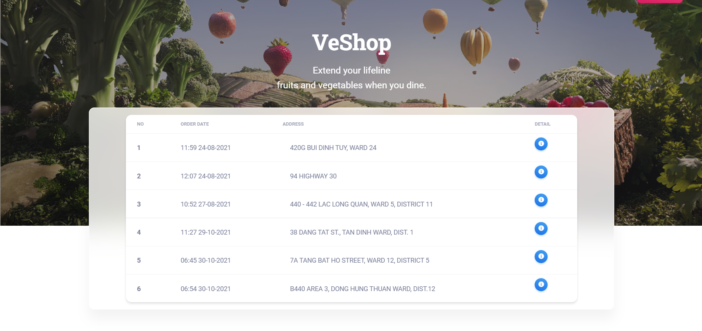
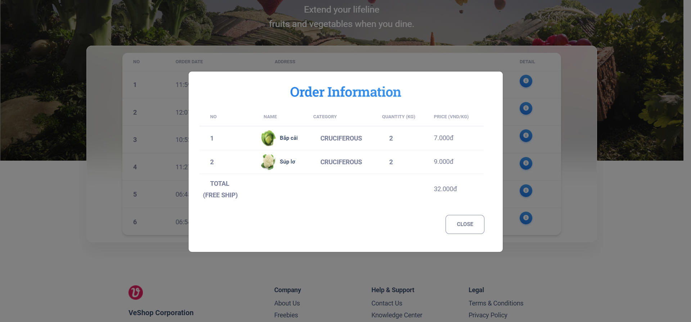
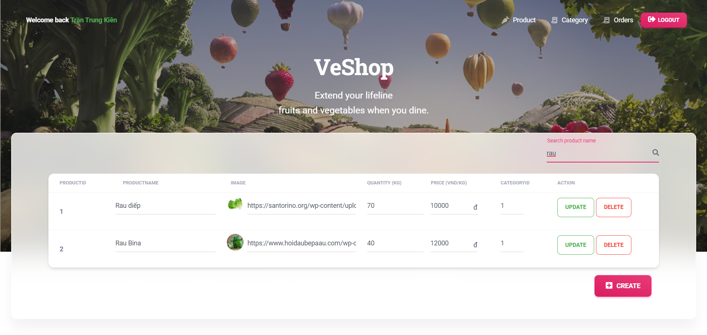

#  VeShop

## [Try it here](https://veshop.herokuapp.com/)

**Note**: This application uses heroku free tier for production so it's maybe slow when startup, please be patient.

## What is VeShop?
- It's a shopping cart application for selling vegetables.
- This web application also contains Admin role for manage stock, category, etc...Therefore, if you find some security issues that can break in to my Admin account, please contact me, I will be very appreciate.
- This application is also my assignment project for my school subject `Java Web Application Development`.
- Work well on `Desktop` only.

## Technology
- Frontend
  - JSTL - Standard Tag Library for JSP
  - Bootstrap 5 - A popular CSS Framework
  - Material Kit 2 - Free & Open Source Web UI Kit
- Backend
  - Servlets - A Java class that extends the capabilities of the servers
  - Log4j - A separate implementation with powerful logging features
  - JDBC - A Java API to connect and execute the query with the database
  - MS SQL - A relational database management system developed by Microsoft

## Some preview images
&nbsp;
&nbsp;
&nbsp;

## How to run
- I built this application with Netbean 8.2 so maybe you can use Netbean IDE to make it more easily to import project.
- If you use other IDE such as Eclipse or Intellij IDEA, you will need to find the way to config this project before use.
- After import this project to IDE, adding JSTL support (almost all IDE support adding JSTL lib) and all external library in `Lib_jar_files`.
- Then, you will need to change `DBHelperExample.java` to `DBHelper.java` and replace database connection information to suit your need.

## Production
- You can use Heroku to deploy since it supports [deploy with war file](https://devcenter.heroku.com/articles/war-deployment).

# License & copyright

© Kirin Tran, FPT University TP.HCM
Licensed under the [MIT LICENSE](LICENSE).
